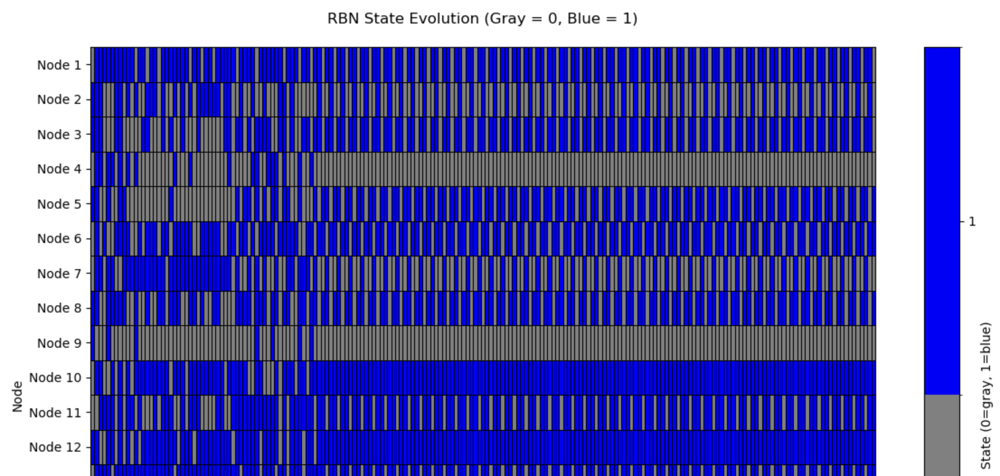

{: width="50%"}

# Random Boolean Networks (RBNs)

This project provides a Python implementation of a Random Boolean Network (RBN) to simulate and visualize the dynamics of such networks. This repository is designed to help you explore how varying the number of inputs per node (K) affects the behavior of the network, including the emergence of order, chaos, and attractors.

## Introduction to Random Boolean Networks

### What is an RBN?

A Random Boolean Network (RBN) is a type of mathematical model used to study the dynamics of complex systems, such as gene regulatory networks, neural networks, and social networks. In an RBN:
- Each node represents a binary variable (0 or 1).
- Nodes are connected, and each node's state is determined by a Boolean function of the states of the nodes that feed into it.
- The network evolves over time, with the state of each node being updated based on its Boolean function.

### Key Concepts

- **Nodes**: The basic elements of the network, each holding a binary state (0 or 1).
- **K (Connectivity)**: The number of inputs that influence each node. This can vary for different nodes within the network.
- **Boolean Functions**: Each node's state is updated based on a Boolean function that takes as input the states of its connected nodes.
  - **Note:** Benefits of Using Random Truth Tables include:
    - Enhanced Complexity: Allows the network to explore a larger space of possible behaviors.
    - Unbiased Behavior: There's no inherent bias towards specific logical operations.
    Alignment with RBN Theory: Reflects the original intention behind RBNs to study complex systems with random interactions.
- **Attractors**: RBNs tend to fall into attractors—repeating patterns of states that the network will cycle through indefinitely.
- **Optional Noise Function:** Introduce noise into the network by randomly flipping the state of nodes with a configurable probability.

### Behavioral Phases of RBNs

- **Ordered Phase (Low K)**: When K is low (e.g., K < 2), the network tends to settle into stable states or simple cycles, leading to predictable behavior.
- **Critical Phase (Intermediate K)**: Around K = 2, the network exhibits a mix of order and chaos, balancing stability with flexibility.
- **Chaotic Phase (High K)**: As K increases (K > 2), the network is more likely to exhibit chaotic behavior, where small changes can lead to large-scale, unpredictable shifts in state.

## Project Features

- **RBN Class**: A modular and reusable class to create and simulate RBNs.
- **Configurable K Range**: Adjust the range of inputs per node to explore different network dynamics.
- **Visualization Tools**: Functions to plot the evolution of network states over time, including heatmaps, scatter plots, and state space diagrams.
- **Example Scripts**: Ready-to-run Python scripts and Jupyter notebooks demonstrating the use of the RBN class.

## Installation

To use this project, clone the repository and install the required dependencies:

```bash
git clone https://github.com/ambron60/rbn-project.git
cd rbn-project
pip install -r requirements.txt
